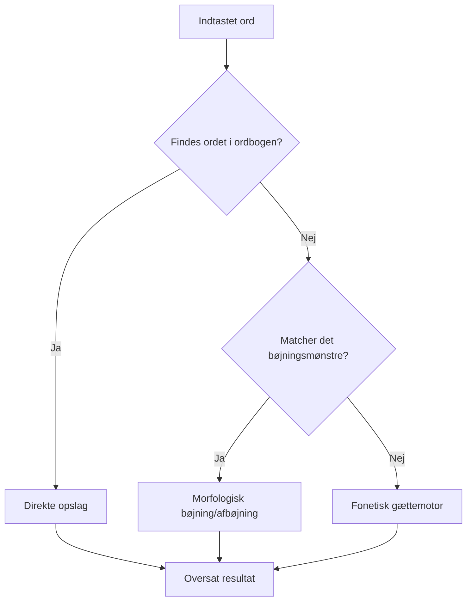

# PorFraDansk 🌍

PorFraDansk er et kunstigt, konstrueret sprog (conlang) skabt som en hybrid mellem **portugisisk**, **fransk** og **dansk**. Sproget forsøger at forene romansk ordforråd og grammatisk systematik med elementer fra dansk sproglære og udtale. 

Dette dokument giver en komplet introduktion til sprogets opbygning, grammatik, fonologi samt den bagvedliggende tekniske motor i oversætteren.

---

## Indholdsfortegnelse
1. [Sprogligt design & Inspiration](#sprogligt-design--inspiration)
2. [Fonologi & Udtaleregler](#fonologi--udtaleregler)
3. [Grammatiske Regler & Struktur](#grammatiske-regler--struktur)
   - [OVS-ordstilling (Objekt-Verb-Subjekt)](#ovs-ordstilling-objekt-verb-subjekt)
   - [Pronomener & Bestemmere](#pronomener--bestemmere)
   - [Verbbøjning (Agglutinerende Suffix-Stacking)](#verbbøjning-agglutinerende-suffix-stacking)
   - [Orddannelse (Derivationer)](#orddannelse-derivationer)
   - [Tal og Numeriske Systemer](#tal-og-numeriske-systemer)
4. [Teknisk Opbygning af Oversætteren](#teknisk-opbygning-af-oversætteren)
   - [1. Ordbogsopslag (dictionary.js)](#1-ordbogsopslag-dictionaryjs)
   - [2. Morfologisk Analyse (translator.js)](#2-morfologisk-analyse-translatorjs)
   - [3. Fonetisk Gættemotor (Transliteration)](#3-fonetisk-gættemotor-transliteration)
   - [4. Brugerflade & Oversættelses-flow](#4-brugerflade--oversættelses-flow)

---

## Sprogligt design & Inspiration

Sproget er tænkt som en syntese af tre primære kildesprog:

| Kildesprog | Bidrag til PorFraDansk | Eksempler |
| :--- | :--- | :--- |
| **Portugisisk** | Ordrødder, verber, pronomener, tidsforståelse | *tu* (du), *vinos* (vi/os fra *vi* + *nós*), *grási* (tak fra *graças*) |
| **Fransk** | Udtaleelementer, bestemmere, pronomener, talord | *un* (en/et), *hil/hel* (han/hun fra *il/elle*), *dö* (to fra *deux*) |
| **Dansk** | Basisord, visse udtalelyde, sproglig base, sammensatte navneord | *ólhai* (hej), *fádeus* (farvel), sammensætninger som *elefantbil* |

---

## Fonologi & Udtaleregler

PorFraDansk benytter en del specielle vokaler og udtaleregler for at give sproget en flydende, men fremmedartet lyd.

### Vokaler og Accenter
Sprogets vokal-accentuering bestemmer udtalen:
*   `á` udtales som det flade **a** i "abe".
*   `a` udtales som det dybe **a** i "magt".
*   `é` udtales som **e** i "ego".
*   `e` udtales som det åbne **æ** i "lære".
*   `ó` udtales som det lukkede **o** i "og".
*   `o` udtales som det åbne **o** i "op".
*   `ö` udtales som det korte, bløde **ø** i "øm".
*   `ø` udtales som det lange **ø** i "øl".

> [!NOTE]
> **Lange vokaler** skrives ved at fordoble vokalbogstavet (f.eks. `ii`, `öö`, `aa`).
> **Diftonger** udtales glidende ud i ét (f.eks. `ai`, `eu`, `ua`). Hvis to vokaler skal udtales hver for sig, adskilles de af en apostrof (f.eks. `a'i`, `e'u`).

### Konsonanter og "R"-reglen
*   `sh` udtales som **sj** i "sjov".
*   `c` udtales som **ch** i "check".
*   `z` udtales som det stemte **j** i det engelske "joke".
*   `dh` udtales som et blødt d (som i "flad").
*   `th` udtales som det engelske ustemte "thick".
*   `ng` udtales som i "sang". En "n"-lyd efterfulgt af en "g"-lyd staves i stedet `ndg` for at undgå forveksling.

> [!IMPORTANT]
> **Den gyldne R-regel:** 
> Bogstavet `r` må **kun** optræde *før* en vokal. Hvis der alligevel skal være en r-agtig lyd efter en vokal, skrives det som `rh` eller repræsenteres som en r-farvet diftong (f.eks. `ór`, `ør`).

---

## Grammatiske Regler & Struktur

### OVS-ordstilling (Objekt-Verb-Subjekt)
Modsat dansk og fransk (der bruger SVO) benytter PorFraDansk en streng **OVS**-ordstilling. 

*   **Dansk (SVO):** *"Dæmon [S] forklarer [V] grænseværdien [O]"*
*   **PorFraDansk (OVS):** *"Ló limvádi [O] foplika [V] Knudh [S]"*
    *   *Literal oversættelse:* "Den grænseværdi [O] forklare-nutid [V] Knud [S]"

> [!TIP]
> **Pro-drop:** 1. og 2. person ental (*shai* (jeg) / *tu* (du)) kan udelades som subjekt, hvis det er åbenlyst ud fra sammenhængen hvem der taler (f.eks. *"Tu teebe ka!"* = "Dræb dig selv!" - bogstaveligt: *"dig [O] dræbe-imperativ [V]"*).

---

### Pronomener & Bestemmere

#### Personlige pronomener
*   **1. person ental (jeg/mig):** `shai`
*   **2. person ental (du/dig):** `tu`
*   **3. person ental (han/ham, hun/hende, den/det):** `hil` / `hel` / `hesa`
*   **Ubestemt (man):** `mon`
*   **1. person flertal (vi/os):** `vinos`
*   **2. person flertal (i/jer):** `ivu`
*   **3. person flertal (de/dem):** `dil`

#### Possessive pronomener (ejestedord)
*   **Min/mit/mine:** `món`
*   **Din/dit/dine:** `tón`
*   **Hans / Hendes / Dens, dets:** `háns` / `héns` / `dés`
*   **Vores / Jeres / Deres:** `voos` / `jaas` / `daas`

#### Artikler & Demonstative bestemmere
*   **Bestemt (den/det):** `ló` + *[Navneord]*
*   **Ubestemt (en/et):** `un` + *[Navneord]*
*   **Denne/dette:** `thes`
*   **Den der/det der:** `thédér`

---

### Verbbøjning (Agglutinerende Suffix-Stacking)
Udsagnsord i PorFraDansk bøjes ved at tilføje præcise endelser (suffikser) direkte på ordets rod (infinitivformen, som altid slutter på `+e`). Endelserne stables i en fastlagt rækkefølge:

$$\text{[Infinitiv-rod]} + \text{[Tid]} + \text{[Aktiv/Passiv/Kausativ]} + \text{[Progressiv/Simpel]} + \text{[Modus]}$$

#### 1. Tempus (Tid)
*   **Infinitiv:** Roden slutter på `+e` (f.eks. *foplike* (at forklare), *mise* (at spise)).
*   **Nutid:** Erstat finalt `-e` med `-a` (f.eks. *foplika*, *misa*).
*   **Datid:** Tilføj `+ró` til infinitiven (f.eks. *foplikeró*).
*   **Fremtid:** Tilføj `+ra` til infinitiven (f.eks. *foplikera*).
*   **I morgen (Nær fremtid):** Tilføj `+bo` til infinitiven (f.eks. *foplikebo*).

#### 2. Stemme og Forårsagelse (Voice/Causation)
*   **Aktiv:** `[Intet suffix]`
*   **Passiv (at blive udsat for handlingen):** Tilføj `+mó` (f.eks. *misemó* = spises / bliver spist).
*   **Causative (at forårsage at handlingen sker):** Tilføj `+ca` (f.eks. *miseca* = får til at spise).
*   **Passive-Causative:** Tilføj `+mócha` (f.eks. *misemócha* = får spist / lader spise).

#### 3. Aspekt (Progressiv)
*   **Progressiv (i gang med at):** Tilføj `+nga` (f.eks. *misenga* = er i gang med at spise).

#### 4. Modus (Måde)
*   **Indikativ (fortællende):** `[Intet suffix]`
*   **Interrogativ (spørgende):** Sæt partiklen `maa` til sidst i sætningen.
*   **Imperativ (bydeform):** Infinitiv + `ka` (f.eks. *foplikeka!* = forklar!).

#### Eksempel på bøjningsstak:
*   *mise* (spise) + *bo* (i morgen) + *mó* (passiv) + *ca* (causativ) + *nga* (progressiv) $\rightarrow$ **`misebomócanga`**
*   **Sætning:** *"Ló dåuz misebomócanga vinos maa?"*
    *   *Dansk:* "Vil vi være i gang med at få hunden til at blive spist i morgen?"

---

### Orddannelse (Derivationer)
For at holde ordforrådet kompakt og logisk, kan ordklasser nemt konverteres:

#### Nounification (Udsagnsord $\rightarrow$ Navneord)
1.  **Agent (en der gør det):** Fjern infinitiv `-e` og tilføj `+ongus` (f.eks. *foplike* (forklare) $\rightarrow$ *foplikongus* (en forklarer)).
2.  **Handling (selve konceptet):** Fjern infinitiv `-e` og tilføj `+éng` (f.eks. *foplike* $\rightarrow$ *foplikéng* (en forklaring)).

#### Adjectification (Navneord $\rightarrow$ Tillægsord)
Alle tillægsord på PorFraDansk ender på `-i`.
1.  **Ender på konsonant:** Tilføj `+i` (f.eks. *mórd* (lort) $\rightarrow$ *mórdi* (lort-agtig)).
2.  **Ender på vokal:** Tilføj `+si` (f.eks. *gi'aani* (Gud) $\rightarrow$ *gi'aanisi* (guddommelig)).

#### Adverbification (Tillægsord $\rightarrow$ Biord)
*   Tilføj `+mang` til tillægsordet (f.eks. *longi* (lang) $\rightarrow$ *longimang* (langt)). Biord placeres efter udsagnsordet.

#### Verbification (Navneord $\rightarrow$ Udsagnsord)
*   Brug det porfradanske ord for "at gøre/lave" (**ge**) koblet på navneordet (f.eks. *game-gøre* = at game, *maling-gøre* = at male).

---

### Tal og Numeriske Systemer
Talbøjninger på PorFraDansk følger et systematisk mønster med franske/romanske rødder:

*   **0:** `théthó`
*   **1:** `un` (jf. fransk *un*)
*   **2:** `dö` (jf. fransk *deux*)
*   **3:** `te` (jf. dansk *tre* / fransk *trois*)
*   **4:** `fo` (jf. dansk *fire* / fransk *quatre*)
*   **5:** `fe` (jf. dansk *fem* / fransk *cinq*)
*   **6:** `döu`
*   **7:** `teu`
*   **8:** `fou`
*   **9:** `feu`
*   **10:** `i`
*   **Tiere (20-90):** Tilføj `+i` til grundtallet (f.eks. `döi` = 20, `tei` = 30, `foi` = 40).
*   **Store enheder:** `sung` (100, jf. fransk *cent* / portugisisk *cem*), `mil` (1000, jf. portugisisk/fransk *mille*), `milóó` (million), `milaa` (milliard).

---

## Teknisk Opbygning af Oversætteren

Oversætteren er bygget som en ren klientside JavaScript-applikation bestående af tre hoveddele:
1.  [dictionary.js](file:///c:/Users/snesk/Documents/programmering/programmering/porfradansk/dictionary.js) – Indeholder ordbogsdata og eksempelsætninger.
2.  [translator.js](file:///c:/Users/snesk/Documents/programmering/programmering/porfradansk/translator.js) – Håndterer oversættelseslogikken, grammatisk bøjningsdetektion og fonetiske faldgruber.
3.  [index.html](file:///c:/Users/snesk/Documents/programmering/programmering/porfradansk/index.html) & [style.css](file:///c:/Users/snesk/Documents/programmering/programmering/porfradansk/style.css) – En premium, responsiv webgrænseflade med mørkt tema, glasagtige effekter og animationer.

Oversættelsesmotoren arbejder i fire lag for at sikre, at tekst altid kan oversættes (selvom ordet ikke findes i ordbogen):

### 1. Ordbogsopslag (dictionary.js)
Når applikationen starter, opbygges to hurtige Map-strukturer (`danskToPf` og `pfToDansk`) for at give øjeblikkelige opslag på hele ord. Hvis et ord findes her, oversættes det direkte.

### 2. Morfologisk Analyse (translator.js)
Hvis et ord ikke findes direkte i ordbogen, forsøger oversætteren at skrælle eventuelle endelser af for at finde stammen:
*   **Fra PorFraDansk til Dansk:** Motoren tjekker listen af verbum-bøjninger (`PF_VERB_SUFFIXES` som `rómónga`, `ranga`, `ró`, `mó`, `nga` osv.) og aflednings-endelser (`ongus`, `éng`, `mang`, `té`). Finder den en match, fjerner den endelsen, slår stammen op, og oversætter samt tilføjer grammatisk info (f.eks. *"spise (datid, progressiv)"*).
*   **Fra Dansk til PorFraDansk:** Motoren genkender almindelige danske bøjninger (f.eks. `-ede`, `-te`, `-er`, `-et`, `-erne`, `-ene`) og erstatter dem med de tilsvarende porfradanske agglutinerende endelser (f.eks. `datid` $\rightarrow$ `+ró`, `bestemt form` $\rightarrow$ `ló` foran ordet).

### 3. Fonetisk Gættemotor (Transliteration)
Hvis et ord hverken findes i ordbogen eller kan afbøjes grammatisk, slår en **fonetisk gættemotor** til (markeret med ✨ i brugerfladen). Denne motor omdanner ordet bogstav for bogstav baseret på sprogets fonologiske regler:
*   Konsonantklynger som `sj` bliver til `sh`, `ch` bliver til `c`, og `w` til `v`.
*   Bløde d'er tilføjes et `h` (`dh`).
*   Vokaler konverteres til deres modsvarende accentuerede former (`æ` $\rightarrow$ `e`, `ø` $\rightarrow$ `ö`, `e` $\rightarrow$ `é`, `o` $\rightarrow$ `ó`, `a` $\rightarrow$ `á`).
*   Post-vokaliske r'er konverteres til `rh` (jf. R-reglen).

### 4. Brugerflade & Oversættelses-flow
*   **Realtidsoversættelse:** Oversættelsen sker øjeblikkeligt (med en lille 150ms debounce-forsinkelse for at undgå lag, mens brugeren skriver).
*   **Ord-for-ord analyse:** Under oversætteren vises en visuel nedbrydning af hvert enkelt ord. Her markeres det, om ordet er fundet direkte i ordbogen (grøn), afledt via bøjninger (blå/⚙), eller gættet fonetisk (lilla/✨).
*   **Interaktiv ordbog:** Brugeren kan søge direkte i ordbogen på tværs af dansk, porfradansk og kommentarer. Klikker man på et ord i listen, indsættes det direkte i oversætterfeltet.